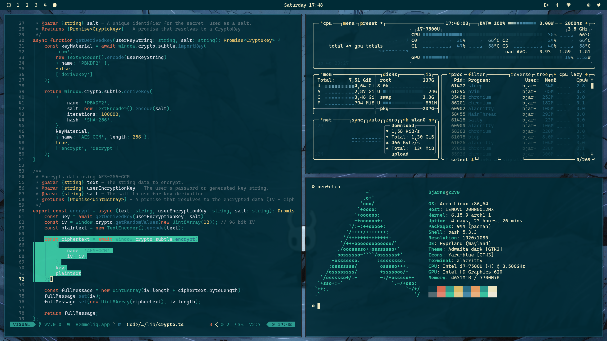
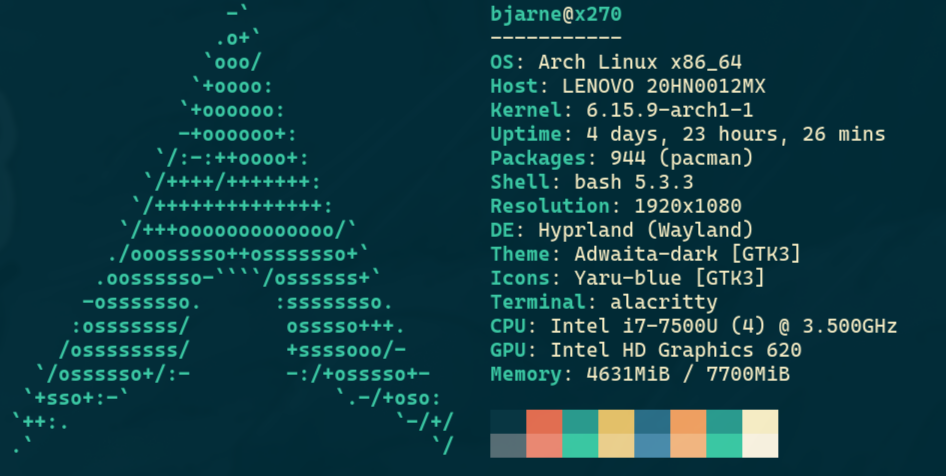

# Hollow Knight Theme

This is the Hollow Knight theme for [Omarchy.org](https://omarchy.org), providing a visually appealing configuration set for your Linux desktop environment.

> In halls of green and paths of grey,  
> A silent knight will find their way.  
> With nail and soul, a kingdom's fate,  
> Through darkened lands, they navigate.     

<p align="center">
  
</p>

<p align="center">
  
</p>

## Installation

To install this theme, simply use the `omarchy-theme-install` command:

```bash
omarchy-theme-install https://github.com/bjarneo/omarchy-hollow-knight-theme
```

## Neovim color scheme
https://github.com/bjarneo/hollow-knight.nvim

## X.com
[iamdothash](https://x.com/iamdothash)
